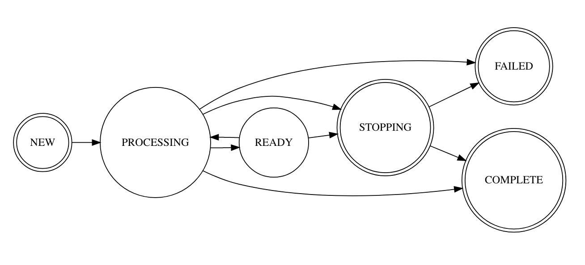

django-db-queue
==========
[](https://pypi.python.org/pypi/django-db-queue)

Simple database-backed job queue. Jobs are defined in your settings, and are processed by management commands.

Asynchronous tasks are run via a *job queue*. This system is designed to support multi-step job workflows.

Supported and tested against:
- Django 3.2, 4.0, 4.1, 4.2, 5.0
- Python 3.8, 3.9, 3.10, 3.11, 3.12

## Getting Started

### Installation

Install from PIP

```
pip install django-db-queue
```

Add `django_dbq` to your installed apps

```python
INSTALLED_APPS = [
    ...,
    "django_dbq",
]
```

Run migrations

```
manage.py migrate
```

### Upgrading from 1.x to 2.x

Note that version 2.x only supports Django 3.1 or newer. If you need support for Django 2.2, please stick with the latest 1.x release.

### Describe your job

In e.g. project.common.jobs:

```python
import time


def my_task(job):
    logger.info("Working hard...")
    time.sleep(10)
    logger.info("Job's done!")
```

### Set up your job

In project.settings:

```python
JOBS = {
    "my_job": {
        "tasks": ["project.common.jobs.my_task"],
    },
}
```

### Hooks


#### Failure Hooks
When an unhandled exception is raised by a job, a failure hook will be called if one exists enabling
you to clean up any state left behind by your failed job. Failure hooks are run in your worker process (if your job fails).

A failure hook receives the failed `Job` instance along with the unhandled exception raised by your failed job as its arguments. Here's an example:

```python
def my_task_failure_hook(job, e):
    ...  # clean up after failed job
```

To ensure this hook gets run, simply add a `failure_hook` key to your job config like so:

```python
JOBS = {
    "my_job": {
        "tasks": ["project.common.jobs.my_task"],
        "failure_hook": "project.common.jobs.my_task_failure_hook",
    },
}
```

#### Creation Hooks
You can also run creation hooks, which happen just after the creation of your `Job` instances and are executed in the process
in which the job was created, _not the worker process_.

A creation hook receives your `Job` instance as its only argument. Here's an example:

```python
def my_task_creation_hook(job):
    ...  # configure something before running your job
```

To ensure this hook gets run, simply add a `creation_hook` key to your job config like so:

```python
JOBS = {
    "my_job": {
        "tasks": ["project.common.jobs.my_task"],
        "creation_hook": "project.common.jobs.my_task_creation_hook",
    },
}
```

#### Pre & Post Task Hooks
You can also run pre task or post task hooks, which happen in the normal processing of your `Job` instances and are executed inside the worker process.

Both pre and post task hooks receive your `Job` instance as their only argument. Here's an example:

```python
def my_pre_task_hook(job):
    ...  # configure something before running your task
```

To ensure these hooks are run, simply add a `pre_task_hook` or `post_task_hook` key (or both, if needed) to your job config like so:

```python
JOBS = {
    "my_job": {
        "tasks": ["project.common.jobs.my_task"],
        "pre_task_hook": "project.common.jobs.my_pre_task_hook",
        "post_task_hook": "project.common.jobs.my_post_task_hook",
    },
}
```

Notes:

* If the `pre_task_hook` fails (raises an exception), the task function is not run, and django-db-queue behaves as if the task function itself had failed: the failure hook is called, and the job is goes into the `FAILED` state.
* The `post_task_hook` is always run, even if the job fails. In this case, it runs after the `failure_hook`.
* If the `post_task_hook` raises an exception, this is logged but the the job is **not marked as failed** and the failure hook does not run. This is because the `post_task_hook` might need to perform cleanup that always happens after the task, no matter whether it succeeds or fails.


### Start the worker

In another terminal:

```
python manage.py worker
```

### Create a job

Using the name you configured for your job in your settings, create an instance of Job.

```python
Job.objects.create(name="my_job")
```

### Prioritising jobs
Sometimes it is necessary for certain jobs to take precedence over others. For example; you may have a worker which has a primary purpose of dispatching somewhat
important emails to users. However, once an hour, you may need to run a _really_ important job which needs to be done on time and cannot wait in the queue for dozens
of emails to be dispatched before it can begin.

In order to make sure that an important job is run before others, you can set the `priority` field to an integer higher than `0` (the default). For example:

```python
Job.objects.create(name="normal_job")
Job.objects.create(name="important_job", priority=1)
Job.objects.create(name="critical_job", priority=2)
```

Jobs will be ordered by their `priority` (highest to lowest) and then the time which they were created (oldest to newest) and processed in that order.

### Scheduling jobs
If you'd like to create a job but have it run at some time in the future, you can use the `run_after` field on the Job model:

```python
Job.objects.create(
    name="scheduled_job",
    run_after=(timezone.now() + timedelta(minutes=10)),
)
```

Of course, the scheduled job will only be run if your `python manage.py worker` process is running at the time when the job is scheduled to run. Otherwise, it will run the next time you start your worker process after that time has passed.

It's also worth noting that, by default, scheduled jobs run as part of the same queue as all other jobs, and so if a job is already being processed at the time when your scheduled job is due to run, it won't run until that job has finished. If increased precision is important, you might consider using the `queue_name` feature to run a separate worker dedicated to only running scheduled jobs.

## Terminology

### Job

The top-level abstraction of a standalone piece of work. Jobs are stored in the database (ie they are represented as Django model instances).

### Task

Jobs are processed to completion by *tasks*. These are simply Python functions, which must take a single argument - the `Job` instance being processed. A single job will often require processing by more than one task to be completed fully. Creating the task functions is the responsibility of the developer. For example:

```python
def my_task(job):
    logger.info("Doing some hard work")
    do_some_hard_work()
```

### Workspace

The *workspace* is an area that can be used 1) to provide additional arguments to task functions, and 2) to categorize jobs with additional metadata. It is implemented as a Python dictionary, available on the `job` instance passed to tasks as `job.workspace`. The initial workspace of a job can be empty, or can contain some parameters that the tasks require (for example, API access tokens, account IDs etc).

When creating a Job, the workspace is passed as a keyword argument:

```python
Job.objects.create(name="my_job", workspace={"key": value})
```

Then, the task function can access the workspace to get the data it needs to perform its task:

```python
def my_task(job):
    cats_import = CatsImport.objects.get(pk=job.workspace["cats_import_id"])
```

Tasks within a single job can use the workspace to communicate with each other. A single task can edit the workspace, and the modified workspace will be passed on to the next task in the sequence. For example:

```python
def my_first_task(job):
    job.workspace['message'] = 'Hello, task 2!'

def my_second_task(job):
    logger.info("Task 1 says: %s" % job.workspace['message'])
```

The workspace can be queried like any [JSONField](https://docs.djangoproject.com/en/3.2/topics/db/queries/#querying-jsonfield). For instance, if you wanted to display a list of jobs that a certain user had initiated, add `user_id` to the workspace when creating the job:

```python
Job.objects.create(name="foo", workspace={"user_id": request.user.id})
```

Then filter the query with it in the view that renders the list:

```python
user_jobs = Job.objects.filter(workspace__user_id=request.user.id)
```

### Worker process

A *worker process* is a long-running process, implemented as a Django management command, which is responsible for executing the tasks associated with a job. There may be many worker processes running concurrently in the final system. Worker processes wait for a new job to be created in the database, and call the each associated task in the correct sequeunce.. A worker can be started using `python manage.py worker`, and a single worker instance is included in the development `procfile`.

### Configuration

Jobs are configured in the Django `settings.py` file. The `JOBS` setting is a dictionary mapping a *job name* (eg `import_cats`) to a *list* of one or more task function paths. For example:

```python
JOBS = {
    'import_cats': ['apps.cat_importer.import_cats.step_one', 'apps.cat_importer.import_cats.step_two'],
}
```

### Job states

Jobs have a `state` field which can have one of the following values:

* `NEW` (has been created, waiting for a worker process to run the next task)
* `READY` (has run a task before, awaiting a worker process to run the next task)
* `PROCESSING` (a task is currently being processed by a worker)
* `STOPPING` (the worker process has received a signal from the OS requesting it to exit)
* `COMPLETED` (all job tasks have completed successfully)
* `FAILED` (a job task failed)

#### State diagram



### API

#### Model methods

##### Job.get_queue_depths
If you need to programatically get the depth of any queue you can run the following:
```python
from django_dbq.models import Job

...

Job.objects.create(name="do_work", workspace={})
Job.objects.create(name="do_other_work", queue_name="other_queue", workspace={})

queue_depths = Job.get_queue_depths()
print(queue_depths)  # {"default": 1, "other_queue": 1}
```

**Important:** When checking queue depths, do not assume that the key for your queue will always be available. Queue depths of zero won't be included
in the dict returned by this method.

#### Management commands

##### manage.py delete_old_jobs
There is a management command, `manage.py delete_old_jobs`, which deletes any
jobs from the database which are in state `COMPLETE` or `FAILED` and were
created more than (by default) 24 hours ago. This could be run, for example, as a cron task, to ensure the jobs table remains at a reasonable size. Use the `--hours` argument to control the age of jobs that will be deleted.

##### manage.py worker
To start a worker:

```
manage.py worker [queue_name] [--rate_limit]
```

- `queue_name` is optional, and will default to `default`
- The `--rate_limit` flag is optional, and will default to `1`. It is the minimum number of seconds that must have elapsed before a subsequent job can be run.

##### manage.py queue_depth
If you'd like to check your queue depth from the command line, you can run `manage.py queue_depth [queue_name [queue_name ...]]` and any
jobs in the "NEW" or "READY" states will be returned.

**Important:** If you misspell or provide a queue name which does not have any jobs, a depth of 0 will always be returned.

### Gotcha: `bulk_create`

Because the `Job` model has logic in its `save` method, and because `save` doesn't get called when using `bulk_create`, you can't easily use `bulk_create` to create multiple `Job` instances at the same time.

If you really need to do this, you should be able to get it to work by using `django_dbq.tasks.get_next_task_name` to compute the next task name from the `name` of the job, and then use that value to populate the `next_task` field on each of the unsaved `Job` instances before calling `bulk_create`. Note that if you use the approach, the job's `creation_hook` will not be called.

## Testing

It may be necessary to supply a DATABASE_PORT environment variable.

## Windows support

Windows is supported on a best-effort basis only, and is not covered by automated or manual testing.

## Code of conduct

For guidelines regarding the code of conduct when contributing to this repository please review [https://www.dabapps.com/open-source/code-of-conduct/](https://www.dabapps.com/open-source/code-of-conduct/)
